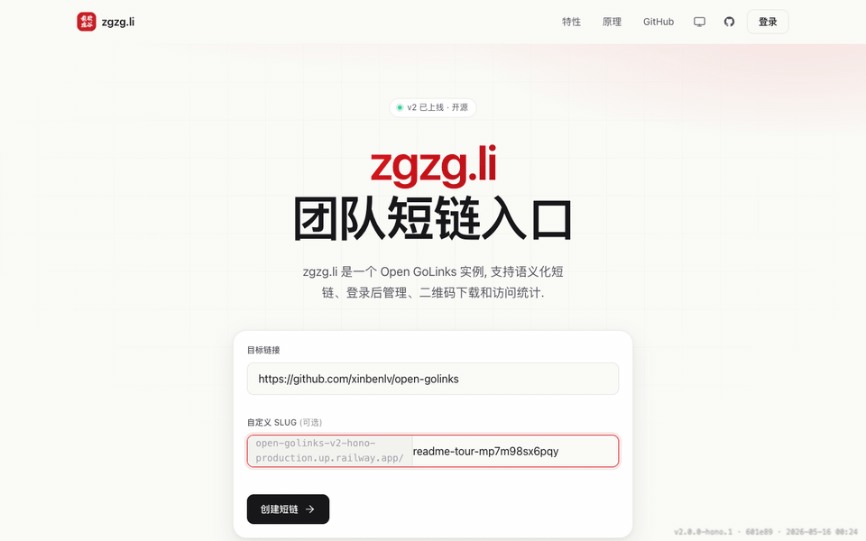

# Open GoLinks

团队内部短链、二维码和访问统计服务。它让团队把常用链接变成好记的 `/{slug}`，同时保留 owner 管理、warning page、QR 下载、审计记录、公开统计和旧 Chrome extension API 兼容能力。



> 上面的动图由浏览器 e2e 截图流程生成：`CAPTURE_README_TOUR=1 bun test tests/browser/readme-tour.spec.ts`。截图用例本地构建前端并启动 Vite preview, mock 所有 API/SSR 数据，并把 demo origin 固定为 `zzgg.li`。

## 这个项目做什么

Open GoLinks 是一个可自托管的 GoLinks / 短链入口：

- 输入任意 URL，生成短 slug，例如 `/roadmap`、`/deploy`、`/docs`。
- 访问 `/{slug}` 时快速 302 到目标地址，并异步记录 visits / GA4 analytics。
- 登录后在 Dashboard 管理自己的链接：搜索、分页、修改 URL、软删、查看 audit / URL history。
- 每个链接都可以生成带 logo 和 caption 的 QR code，支持预览、PNG 下载和旧路径兼容。
- 高风险链接可以启用 warning interstitial，让访问者先确认再跳转。
- 公开 `/stats` 和 `/stats/:slug` 提供只读 GA4 统计视图。
- 保留 `/api/v2` legacy shim，兼容旧 Chrome extension 的 link lookup / edit / availability 行为。

## 功能特性

- **短链核心路径**：`GET /:slug` 查询 Postgres 后立即 302，analytics 用异步写入避免拖慢跳转。
- **链接管理**：Supabase Magic Link 登录，owner-only CRUD，匿名创建后可通过 fingerprint / legacy email claim。
- **二维码**：浏览器 canvas 预览 + 服务端 PNG，支持 `/qr/:slug.png` inline 和 `/qr/d/:slug.png` download。
- **安全与合规提示**：link-level warning toggle，SSR warning page 不依赖 SPA bundle。
- **统计与审计**：daily visits、GA4 Data API 查询、audit timeline、URL history、ownership transfer。
- **品牌主题**：默认 Open GoLinks 主题；`OPEN_GOLINK_THEME=zgzg` 时启用 ZGZG 文案、logo、favicon 和主题色。
- **低成本部署**：单个 Bun + Hono 进程同时托管 API 和 Vite/React 静态资产，目标 Railway 单容器运行。

## 架构速览

```
Browser / Extension
        │
        ▼
Railway single container
Bun + Hono API + Vite React SPA
        │
        ├── Supabase Postgres: links / users / audit_logs / daily_visits
        ├── Supabase Auth: Magic Link + JWT
        └── GA4: Measurement Protocol + Data API
```

核心代码位置：

- `src/server.ts`：Hono 入口和生产 SPA 托管。
- `src/routes/redirect.ts`：短链跳转 hot path。
- `src/routes/api/links.ts`：链接 CRUD、claim、transfer、metadata。
- `src/routes/api/stats.ts`：公开 stats query。
- `src/routes/qr.ts` 与 `src/lib/qr.ts`：QR PNG 兼容路径和渲染。
- `src/web/`：React SPA 页面、组件和 hooks。

## 快速开始

```sh
bun install
cp template.env .env
bun run db:migrate

# 终端 1: API / 生产静态托管入口，默认 3000
bun run dev

# 终端 2: Vite dev server，默认 5173，并代理 /api 到 3000
bun run dev:web
```

访问：

- 前端开发：`http://localhost:5173/`
- API / redirect smoke：`http://localhost:3000/{slug}`
- 健康检查：`GET /api/v1/health`

常用验证：

```sh
bun run type-check
bun test:e2e
bun run build
```

## 部署

生产部署在 Railway，详见 [`DEPLOYMENT.md`](./DEPLOYMENT.md)。最小必需环境变量包括 `DATABASE_URL`、`PUBLIC_BASE_URL`、`VITE_BASE_URL`、Supabase Auth/JWT 配置，以及 GA4 配置。自定义域名切换时，`PUBLIC_BASE_URL` 和 `VITE_BASE_URL` 必须一起更新并重新部署。

## 开发者文档

- [当前架构](./docs/CURRENT-ARCHITECT.md)：系统图、路由、数据流、环境变量。
- [前端说明](./src/web/README.md)：SPA 路由、页面组件、主题和构建约定。
- [测试说明](./tests/README.md)：e2e、浏览器 smoke、README GIF 生成流程。
- [迁移脚本](./scripts/README.md)：legacy MongoDB 到 Supabase Postgres 的迁移/修复工具。
- [产品 Spec](./docs/v2-SPEC-zh-2.1.md)：v2 产品目标和功能范围。
- [计划目录](./docs/plans/README.md)：活跃计划和已归档计划。
- [排障记录](./docs/troubleshooting/)：生产切域名、Supabase、Railway、reserved path 等历史坑。

## 兼容性承诺

迁移后必须保持 **slug URL 兼容**：既有 `/{slug}` 短链继续可访问。内部 API schema、Dashboard UI 和 auth session 不承诺向前兼容，但 `/api/v2` shim 会覆盖当前 Chrome extension 仍依赖的 legacy 行为。
