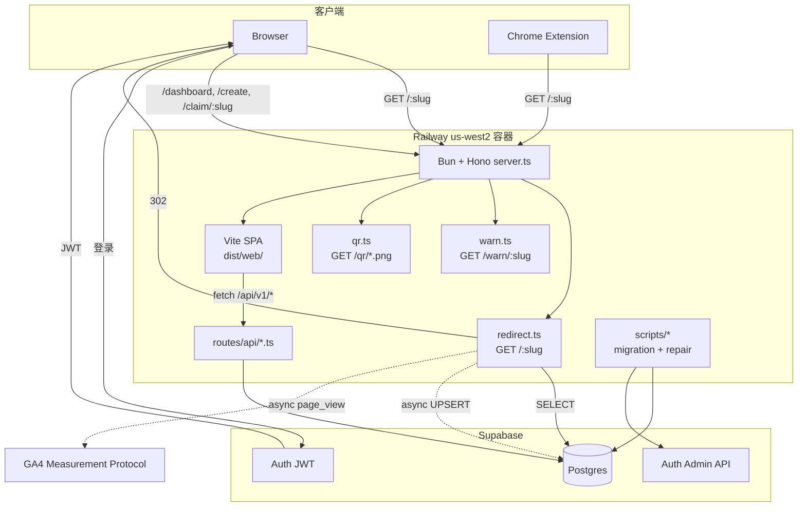

# CURRENT-ARCHITECT

> v2-hono 实现的当前架构. 修改代码后必须同步更新此文档. 详见 [`.claude/rules/current-architect.md`](../.claude/rules/current-architect.md).

## System Overview

### ASCII 简图

```
              ┌──────────────────────────────────────────────┐
              │   Railway 单容器 (us-west2, sjc-adjacent)    │
              │                                              │
   Browser ──▶│  Bun + Hono                                  │
   Extension  │   ├─ /:slug          → 302 + 异步 analytics  │
              │   ├─ /warn/:slug     → SSR warning HTML      │
              │   ├─ /qr/:slug.png    → QR PNG compat         │
              │   ├─ /api/v1/health  → JSON                  │
              │   ├─ /api/v1/audit   → owner audit timeline   │
              │   ├─ /api/v1/links   → CRUD + claim + audit  │
              │   ├─ /api/v1/me      → JWT 当前用户           │
              │   ├─ /api/v1/stats   → owner summary + public GA4 query │
              │   └─ /*              → 静态 SPA (dist/web)   │
              └──────────┬───────────────────────────────────┘
                         │ postgres-js + Drizzle
                         ▼
                 Supabase Postgres
                 (links / audit_logs / daily_visits / users)
                         ▲
                         │
                 Supabase Auth (JWT + Admin API for migration/repair)
```

### Mermaid 详细图



## 模块说明

### 入口
- **`src/server.ts`** - Hono app 装配, 注册路由, 在生产托管 SPA. Bun 用 `default { port, fetch }` 自动监听.

### 路由
- **`src/routes/redirect.ts`** (`GET /:slug`)
  - 校验 slug 格式 + 保留路径; RESERVED 或不合法格式 → `next()`, 交给静态资源 / SPA fallback
  - 查询 `links` 表 (排除软删除)
  - 若 `metadata.show_warning === true` 且未带 `?confirm=1`, 302 到 `/warn/:slug`
  - 命中 → 302 立即返回, 用 `queueMicrotask` 异步累加 visits + UPSERT daily_visits
  - 未命中 (合法但未创建) → 302 到 `/edit/<slug>`, 让用户走 Landing 同款表单创建
- **`src/routes/warn.ts`** (`GET /warn/:slug`)
  - Hono SSR route, 返回自包含 HTML, 不依赖 SPA bundle
  - 查询未删除链接; 不存在/已删除 → 404
  - Proceed 链接指向 `/:slug?confirm=1`, 让 redirect hot path 真正跳转并记录 analytics
  - 样式从 `src/lib/brand.ts` 注入 favicon 与 brand/action/warning 语义色; ZGZG 下 warning 用 amber, Proceed 用中性 action 色 (`src/routes/warn.ts:51-132`)
- **`src/routes/qr.ts`** (`GET /qr/:slug.png`, `GET /qr/d/:slug.png`)
  - master-compatible QR PNG paths; `/d/` 变体加 `Content-Disposition: attachment`
  - 接受 `caption` 和 `addLogo=true`, 返回 `image/png`
- **`src/routes/api/health.ts`** (`GET /api/v1/health`) - 简单 JSON 健康检查
- **`src/routes/api/audit.ts`** (`GET /api/v1/audit/:slug`) - requireAuth + owner-only; 返回当前链接 CREATE/UPDATE/DELETE/CLAIM/TRANSFER 审计日志, 支持 `limit` + `(timestamp,id)` cursor 分页, `VISIT` 不返回.
- **`src/routes/api/links.ts`** (`/api/v1/links`)
  - `GET /` - require JWT, 只列出当前用户链接; `owner` 只能省略或为 `me`, 支持 cursor/q/limit/tag; F12 已 drop 公开列表, `owner=public` 返回 `INVALID_INPUT`; 返回 DTO 会脱敏内部 legacy owner metadata (`src/routes/api/links.ts:182-249`)
  - `POST /` - 创建链接; 有 Bearer JWT 时写 `owner_id`, 匿名时走 IP+UA 限流并保存 `X-Fingerprint`; 新建/恢复默认 `is_public=false`; 可写 `metadata.description/tags/show_warning`; 写 CREATE audit; 返回 DTO 脱敏 (`src/routes/api/links.ts:252-310`)
  - `GET /claimable` - requireAuth; 返回当前用户可通过 fingerprint 或 canonical `metadata.legacy_author_email` 认领的未归属链接 (`src/routes/api/links.ts:312-350`)
  - `GET /:slug/available` - public availability check, 返回 `{ available: boolean }`; F13 `/api/v2/available/:slug` shim 复用同一语义
  - `GET /:slug` - 获取单链接, 公开返回中不包含 `metadata.legacy_author_email` (`src/routes/api/links.ts:361-375`)
  - `POST /:slug/claim` - requireAuth; `owner_id IS NULL` + fingerprint/legacy email proof 在同一个原子 UPDATE 中检查, 成功后写 CLAIM audit (`src/routes/api/links.ts:378-432`)
  - `POST /:slug/transfer` - owner-only; recipient email 先 canonicalize 再查找已注册用户, 写 TRANSFER audit; 未注册 `USER_NOT_FOUND`, 自转 `SELF_TRANSFER` (`src/routes/api/links.ts:435-490`)
  - `PATCH /:slug` - owner-only 更新 URL, 旧 URL 进入 `url_history`; strict metadata whitelist 允许 `description<=280`, `tags<=10` 且单 tag `<=20`, `show_warning`; 写 UPDATE audit; 返回 DTO 脱敏 (`src/routes/api/links.ts:493-564`)
  - `DELETE /:slug` - owner-only 软删, 写 DELETE audit
- **`src/routes/api/me.ts`** (`GET /api/v1/me`) - 通过 Supabase JWT 返回当前用户 `{ id, email, role }`
- **`src/routes/api/qr.ts`** (`GET /api/v1/qr/:slug`) - 公开 QR PNG endpoint; `format=png`, `caption<=100`, `logo=true`; 不存在/软删返回 404.
- **`src/routes/api/stats.ts`** (`/api/v1/stats`)
  - `GET /summary` - requireAuth; 查询当前用户 owned slugs 后调用 GA4 Data API, 返回 `{ totalClicks, days, source, scope }`.
  - `POST /query` - public read-only; 受控详细查询, 只接受 `range`, `groupBy`, `limit`, `pathRegex`, `usePathPlusQueryString`, `slug?`; 无 `slug` 时查所有未删除链接并用 GA4 `pagePath` slug 格式 + reserved/system path 排除过滤, 有 `slug` 时只查该未删除 slug, 不存在/已删除返回 404.
- **`src/routes/api/v2-compat.ts`** (`/api/v2`)
  - F13 Chrome extension / master API compatibility shim.
  - `GET /link/:slug` 返回 master array shape (`goLink`, `goDest`, `destHistory`, `addLogo`, `caption`, `editable`); 非 owner 不暴露 owner email.
  - `GET /available/:slug` 返回 legacy boolean.
  - `POST /edit` 接受 `{ golink, dest, addLogo?, caption? }`; 匿名可创建, 更新 require Supabase owner Bearer JWT, 写 audit/url_history/metadata.
  - `GET /my-links` 仅支持 Supabase Bearer JWT; 旧 Auth0 cookie 不兼容.

### Middleware
- **`src/middleware/auth.ts`** - Supabase Auth JWT 验证 middleware:
  - `requireAuth`: 缺失或无效 Bearer token → 401
  - `optionalAuth`: 有 token 就验, 无 token 继续匿名
  - 首次见到 JWT `sub` 时 lazy upsert `public.users`, email 统一 `trim().toLowerCase()`, 供 `links.owner_id` / `audit_logs.actor_id` 外键使用 (`src/middleware/auth.ts:71-90`)
- **`src/middleware/audit.ts`** - `writeAudit(c, action, slug, diff?)`, 对低频 CREATE/UPDATE/DELETE/CLAIM/TRANSFER 写 `audit_logs`; `VISIT` 不写 audit.
- **`src/middleware/ratelimit.ts`** - 匿名写操作 IP+UA 内存 token bucket: 5/min + 30/hour; 已登录用户 bypass.
- **`src/lib/fingerprint.ts`** - 浏览器端 64-hex fingerprint: canvas + UA + timezone + screen; canvas 不可用时用本地持久 fallback token. 服务端只校验格式和比对已有值.
- **`src/lib/identity.ts`** - identity helper: canonical email、metadata normalize、link DTO 删除 `metadata.legacy_author_email` (`src/lib/identity.ts:1-27`).
- **`src/lib/brand.ts`** - 品牌主题配置；`OPEN_GOLINK_THEME=zgzg` 时使用 `zgzg.li` 文案和 ZGZG favicon, 并区分 brand/action/warning 语义色: ZGZG 红色是品牌 accent, primary action 使用中性色 (`src/lib/brand.ts:3-116`)。
- **`src/lib/qr.ts`** - `qrcode` + `@napi-rs/canvas` 服务端 QR PNG 渲染, 支持 CJK caption、主题 logo、1h/1000-entry LRU cache, 字体来自 `src/assets/fonts/NotoSansCJKsc-Regular.otf`, 服务端 ZGZG QR logo 来自 `src/assets/img/zgzg-round-logo.png`, 默认 QR fallback 使用 brand 色。

### 数据
- **`src/db/db.ts`** - postgres-js client + Drizzle 实例. `prepare: false` 兼容 Supabase pooler.
- **`src/db/schema.ts`** - Drizzle schema, 4 张表:
  - `users` (sync 自 Supabase auth.users; `id = auth.users.id`; email 有普通 unique 和 `lower(email)` unique index) (`src/db/schema.ts:23-37`)
  - `links` (slug 主键, soft delete, url_history JSONB)
  - `audit_logs` (CREATE/UPDATE/DELETE/CLAIM/VISIT/TRANSFER)
  - `daily_visits` (UNIQUE(slug, date), 用于 analytics)
- **`src/db/migrations/0002_identity_acl_email_canonical.sql`** - apply 前阻止 duplicate canonical email, 将 `public.users.email` 规范为 lowercase/trim, 并创建 `unique_users_email_lower` (`src/db/migrations/0002_identity_acl_email_canonical.sql:1-16`).

### 前端 (SPA)
- **`src/web/`** - Vite + React 19 + react-router-dom v7. 详见 [`src/web/README.md`](../src/web/README.md).
  - `src/web/styles/tokens.css` 定义 brand/action/warning/danger 语义色; 默认主题 action alias 到橙色 brand, ZGZG 主题 action 改为中性色且保留红色 brand accent (`src/web/styles/tokens.css:20-237`).
  - `src/web/lib/brand.ts` 给浏览器和 SSG 统一解析主题, ZGZG 前端 logo/favicon 使用 Vite public path `/zgzg-round-logo.png`, 避免 SSG 输出本地文件路径 (`src/web/lib/brand.ts:1-24`)。
  - `/` Landing (`src/web/pages/Landing/`) 由 `scripts/prerender.ts` 在构建期 SSG 预渲染到 `dist/web/index.html`.
  - `/edit/:slug` 对不存在 slug 复用 Landing 创建流; 对已存在链接, 登录 owner 可编辑 URL / 软删, 底部展示 `UrlHistory` 与 `AuditTimeline`.
  - `/login` / `/auth/callback` 是 Supabase magic link 登录流, 走客户端 lazy chunk; callback 优先处理 `?code=...`, 并兼容 Admin generated-link / legacy `#access_token=...` session hash.
  - `/auth/confirm` 是 Supabase TokenHash 邮件链接入口, 调 `verifyOtp` 后把 session token 交给 `/auth/callback` 的 hash-token 分支。
  - Supabase Magic Link 邮件模板维护在 `docs/email-templates/`, 分默认 Open GoLinks 和 ZGZG 两套主题, 邮件按钮使用 `{{ .SiteURL }}/auth/confirm?token_hash={{ .TokenHash }}&type=email`；部署/Supabase/Resend 操作见 `DEPLOYMENT.md`。
  - `/dashboard` 由 `AuthGuard` 保护, 展示 owner 链接列表, 支持搜索、分页加载、Edit/Delete actions, 顶部嵌入 `ClaimBanner` 和 `StatsChart`.
  - `/stats` / `/stats/:slug` 是公开只读 GA4 统计视图, 调 `/api/v1/stats/query` 展示全站或单 slug 的 path 表、path share 饼图、date 折线, 支持 7/30/90/180 天、路径正则、pagePathPlusQueryString 切换.
  - `/claim/:slug` 是单链接认领页; 未登录时提示登录, 登录后用 fingerprint 或 legacy author email 调 claim API.
  - `/edit/:slug` 和创建成功态内嵌 QR editor; `/qr/:slug` 仍是独立 QR editor. 浏览器 canvas 实时预览 caption/logo, 下载走 `/qr/d/:slug.png`.
  - `/create` 复用 Landing 创建体验.
  - `/warn/:slug` 不再走 SPA; 由 Hono `src/routes/warn.ts` 直接返回 SSR HTML.
  - `src/web/hooks/useAuth.ts` 维护 Supabase session store, 暴露 `signInWithMagicLink`, `signOut`, `authFetch`; `src/web/hooks/useApi.ts` 封装 JSON API 请求.
  - 客户端 `src/web/main.tsx:14-32` 智能切换 `hydrateRoot` (Landing 命中预渲染) / `createRoot` (其他路径).
- 构建输出 `dist/web/`, 由 Hono `serveStatic` 在生产托管.

### 脚本 (前端构建)
- **`scripts/prerender.ts`** - SSG 入口, 由 `bun run build:web` 在 `vite build` 之后执行.
  - import `src/web/entry-ssr.tsx#renderApp("/")` 拿到 Landing HTML 字符串
  - 注入 `<title>` / `<meta>` (description / og:* / twitter:* / theme-color) + 品牌 favicon + 防闪烁主题脚本 (`scripts/prerender.ts:53-81`)
  - 写回 `dist/web/index.html`

### 脚本
- **`scripts/lib/identity-acl.ts`** - migration/repair 共享 identity helper: Supabase Admin `listUsers`, `email -> auth.users.id` resolver, silent `createUser`, public mirror upsert/remap, coverage report 和 apply 前 JSON 备份 (`scripts/lib/identity-acl.ts:63-75`, `scripts/lib/identity-acl.ts:84-121`, `scripts/lib/identity-acl.ts:155-258`, `scripts/lib/identity-acl.ts:278-358`, `scripts/lib/identity-acl.ts:368-438`).
- **`scripts/migrate-from-legacy.ts`** - MongoDB → Postgres 一次性迁移; legacy email 只映射到 Supabase Auth UUID, `"anonymous"`/无效 email 保持 `owner_id = null`, 默认不覆盖已有非空 owner, dry-run/apply 后输出 owner coverage 和 identity consistency (`scripts/migrate-from-legacy.ts:134-187`, `scripts/migrate-from-legacy.ts:222-295`, `scripts/migrate-from-legacy.ts:313-383`).
- **`scripts/inspect-mongo.ts`** - 检查源数据形态
- **`scripts/reconcile-legacy-owners.ts`** - Identity ACL repair: dry-run 扫描 synthetic `public.users`, apply 前备份 `users/links/audit_logs`, transaction 中 remap 到真实 Auth user 或置空 owner/conflict (`scripts/reconcile-legacy-owners.ts:93-165`, `scripts/reconcile-legacy-owners.ts:167-218`).
- **`docs/troubleshooting/identity-acl-data-cleanup.md`** - 记录 Identity ACL 生产数据清理注意事项；`links` 表以 `slug` 为主键，一次性备份/修复脚本不能假设存在 `id` 列。

### 测试与视觉资产
- **`tests/e2e/*.test.ts`** - Bun e2e 回归测试, 覆盖 API / route 行为, 不依赖前端构建。
- **`tests/browser/*.spec.ts`** - Puppeteer + 系统 Chrome 的生产/浏览器 smoke tests; `tests/browser/readme-tour.spec.ts` 是可选截图用例, 由 `CAPTURE_README_TOUR=1` 开启, 本地构建前端并启动 Vite preview、mock API/SSR 数据, 写入 `docs/assets/readme-tour.gif` (`tests/browser/readme-tour.spec.ts:12-29`, `tests/browser/readme-tour.spec.ts:223-267`, `tests/browser/readme-tour.spec.ts:413-492`)。

### 外部服务
- **`src/lib/gcp.ts`** - 启动时把 `GOOGLE_APPLICATION_CREDENTIALS_JSON` 写到 `/tmp/open-golinks-gcp-key.json`, 供 Google SDK 使用.
- **`src/lib/ga4.ts`** - GA4 Data API summary/detail 查询 + Measurement Protocol `page_view` 上报 helper.

## 数据流

### 短链重定向 (hot path)
1. 用户访问 `https://go.example.com/abc`
2. Cloudflare CDN cache miss → 转 Railway
3. Hono `redirect.ts:slug` handler
4. Drizzle 查 `links WHERE slug=$1 AND deleted_at IS NULL`
5. 命中 → 返回 302 (响应已 flush 给客户端)
6. 异步: 事务内累加 `links.visits` + UPSERT `daily_visits`; fire-and-forget 上报 GA4 `page_view`

### 创建短链
1. 用户在 Landing (或 `/edit/<slug>`, slug 自动预填) 填表; 浏览器计算 fingerprint, SPA POST `/api/v1/links` JSON `{slug, url}` + `X-Fingerprint`
2. Hono `links.ts` zod 校验; 登录请求忽略 fingerprint 并写 `owner_id`, 匿名请求保存 `created_by_fingerprint`
3. INSERT, 唯一约束失败 (Drizzle 把 PG 的 23505 包成 `DrizzleQueryError`, 从 `err.cause.code` 解出) 返回 `SLUG_TAKEN` 409
4. 客户端拿到 409 后, 自动生成的 slug 重试一次; 用户自定义的 slug 则在表单内提示
5. 已登录请求写 `owner_id`; 匿名请求进入 IP+UA rate limit; CREATE 写 `audit_logs`

### Warning interstitial
1. Owner 在 `/edit/:slug` 勾选 `WarnToggle`, PATCH `/api/v1/links/:slug` body `{ metadata: { show_warning: true } }`
2. 访客访问 `/:slug`, redirect handler 发现 `metadata.show_warning` 且没有 `?confirm=1`, 返回 302 `/warn/:slug`
3. `/warn/:slug` SSR HTML 展示目标 URL, 不加载 SPA assets; warning 视觉使用 amber, Proceed 按钮使用 action token 而不是品牌红色
4. 用户点 Proceed 访问 `/:slug?confirm=1`, redirect handler 跳过 warning, 返回目标 URL 302 并记录 visits/GA4

### Audit history
1. Owner 打开 `/edit/:slug`, 页面确认当前用户拥有该链接
2. `AuditTimeline` 调 `GET /api/v1/audit/:slug?limit=20`
3. 后端先校验 `links.owner_id = JWT sub`; 非 owner 403, 不存在/已删除 404
4. 返回按 `timestamp DESC, id DESC` 排序的审计日志, `UPDATE` 等带 diff 的事件可在 UI 展开查看 JSON
5. `Load more` 用 base64url cursor 继续取下一页

### URL history
1. Owner 在 `/edit/:slug` 保存新目标 URL
2. `PATCH /api/v1/links/:slug` 把旧 URL 追加到 `links.url_history` (`{ url, changedAt, changedBy }`)
3. Edit 页 `UrlHistory` 直接使用 `GET /api/v1/links/:slug` 返回的 `urlHistory`, newest-first 展示历史目标 URL
4. 旧数据若不是数组或条目缺少 `url`, 前端 normalize 后忽略, 显示 "No previous URLs" 而不崩溃

### Ownership transfer
1. Owner 在 `/edit/:slug` 的 Danger zone 输入接收方 email 并确认
2. `POST /api/v1/links/:slug/transfer` 要求接收方已登录过并存在于 `public.users`
3. 后端校验当前用户仍是 owner, 更新 `links.owner_id`, 写 `audit_logs.action = TRANSFER`
4. 发起方立即失去 owner 权限; 接收方的 `/dashboard` 可看到该链接

### QR code
1. 用户在 `/edit/:slug` 或 `/qr/:slug` 中看到 `QrCanvas` 实时预览短链 QR; 创建成功态也显示可下载 QR
2. `caption` / `addLogo` 作为 link `metadata` 保存; `/qr/*.png` 未传 query 时读取已保存设置
3. 下载按钮指向 `/qr/d/:slug.png?caption=...&addLogo=true`
4. 兼容旧路径 `/qr/:slug.png` 返回 inline PNG; `/qr/d/:slug.png` 返回 attachment PNG
5. 服务端 QR PNG 始终编码短链 URL (`PUBLIC_BASE_URL` 或请求 origin + `/:slug`), 不直接编码 destination URL

### Detailed analytics
1. 任何用户访问 `/stats` 或 `/stats/:slug`
2. SPA 并行 POST 两次 `/api/v1/stats/query`: 一次 `groupBy=path`, 一次 `groupBy=date`
3. 后端查未删除 links: `/stats` 注入全站 slug scope 并用 GA4 `pagePath` slug 格式过滤, 同时排除 `/healthz`、`/dashboard`、`/stats` 等 reserved/system path; `/stats/:slug` 只保留目标 slug, 不存在/已删除返回 404
4. `src/lib/ga4.ts#queryStatsForSlugs` 用 GA4 Data API 查询 `page_view`; 可选用户 `pathRegex` 只作为额外过滤条件, 不暴露任意 GA4 passthrough
5. SPA 渲染 path 表、path share 饼图、day 折线; 空数据展示 "No data yet", GA4 错误降级为页面 alert

### 匿名链接认领
1. 匿名创建成功后, 客户端把 `{ slug, fingerprint }` 记入 `localStorage('golinks:created')`
2. 用户登录后进 `/dashboard`, `ClaimBanner` 计算当前浏览器 fingerprint 并调 `GET /api/v1/links/claimable?fingerprint=<64hex>`
3. 后端返回两类未归属链接: `created_by_fingerprint` 匹配, 或 canonical `metadata.legacy_author_email` 等于当前用户 email
4. 用户点击 Claim 后, `POST /api/v1/links/:slug/claim` 用单条原子 UPDATE 写 `owner_id`, 只有 `owner_id IS NULL` 且 proof predicate 同时成立才成功, 并记录 `audit_logs.action = CLAIM`
5. Dashboard reload 后, 被认领链接通过 `GET /api/v1/links?owner=me` 出现在 owner 列表

## 环境变量

| 变量 | 必需 | 说明 |
|---|---|---|
| `DATABASE_URL` | ✅ | Supabase Postgres 连接串 (用 pooler `:6543`) |
| `PORT` | - | Railway 自动注入, 本地默认 3000 |
| `NODE_ENV` | - | `production` 时托管 SPA |
| `SUPABASE_JWKS_URL` | ✅ | JWT 验证 JWKS URL |
| `SUPABASE_JWT_ISSUER` | ✅ | JWT issuer 校验 |
| `SUPABASE_URL` | 迁移/repair | Supabase Auth Admin API project URL；可由 `VITE_SUPABASE_URL` fallback |
| `SUPABASE_SECRET_KEY` | 迁移/repair | Supabase service-role/Admin key；可由 `SUPABASE_SERVICE_ROLE_KEY` fallback |
| `VITE_SUPABASE_URL` | ✅ | 前端 Supabase client URL |
| `VITE_SUPABASE_PUBLISHABLE_KEY` | ✅ | 前端 Supabase publishable key |
| `VITE_BASE_URL` | ✅ | magic link redirect base URL；生产切域名时必须和 canonical origin 保持一致 |
| `PUBLIC_BASE_URL` | ✅ | GA4 `page_location` / 完整短链 base URL；生产 canonical origin |
| `OPEN_GOLINK_THEME` | - | 品牌主题, 默认 `open-golinks`; 设为 `zgzg` 时启用 ZGZG 文案、logo 与品牌/accent 色 |
| `GA4_MEASUREMENT_ID` | ✅ | Measurement Protocol |
| `GA4_API_SECRET` | ✅ | Measurement Protocol |
| `GA4_PROPERTY_ID` | ✅ | GA4 Data API |
| `GOOGLE_APPLICATION_CREDENTIALS_JSON` | ✅ | GCP service account JSON |
| `TURNSTILE_SECRET_KEY` | 待用 | 创建链接的 bot 防护 |
| `TURNSTILE_SITE_KEY` | 待用 | 前端嵌入 |

## 启动流程

1. Bun 加载 `src/server.ts`
2. import `./routes/redirect.ts`, `./routes/api/*` 触发 db.ts 加载 → 检查 `DATABASE_URL`
3. Hono app 注册路由
4. `default { port, fetch }` 让 Bun 监听
5. Railway healthcheck 命中 `/api/v1/health` 后开始接流量

## 当前未实现 (TODO)

- Turnstile 校验
- CI/CD (GitHub Actions → Railway)
