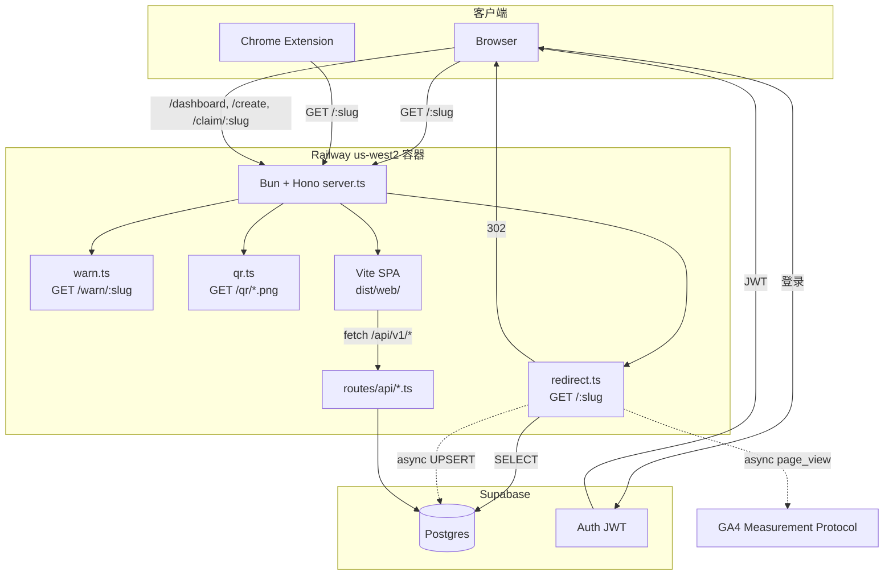

# CURRENT-ARCHITECT

> v2-hono 实现的当前架构. 修改代码后必须同步更新此文档. 详见 [`.claude/rules/current-architect.md`](../.claude/rules/current-architect.md).

## System Overview

### ASCII 简图

```
              ┌──────────────────────────────────────────────┐
              │   Railway 单容器 (us-west2, sjc-adjacent)    │
              │                                              │
   Browser ──▶│  Bun + Hono                                  │
   Extension  │   ├─ /:slug          → 302 + 异步 analytics  │
              │   ├─ /warn/:slug     → SSR warning HTML      │
              │   ├─ /qr/:slug.png    → QR PNG compat         │
              │   ├─ /api/v1/health  → JSON                  │
              │   ├─ /api/v1/links   → CRUD + claim + audit  │
              │   ├─ /api/v1/me      → JWT 当前用户           │
              │   ├─ /api/v1/stats   → scoped GA4 stats/query │
              │   └─ /*              → 静态 SPA (dist/web)   │
              └──────────┬───────────────────────────────────┘
                         │ postgres-js + Drizzle
                         ▼
                 Supabase Postgres
                 (links / audit_logs / daily_visits / users)
                         ▲
                         │
                 Supabase Auth (JWT)
```

### Mermaid 详细图



## 模块说明

### 入口
- **`src/server.ts`** - Hono app 装配, 注册路由, 在生产托管 SPA. Bun 用 `default { port, fetch }` 自动监听.

### 路由
- **`src/routes/redirect.ts`** (`GET /:slug`)
  - 校验 slug 格式 + 保留路径; RESERVED 或不合法格式 → `next()`, 交给静态资源 / SPA fallback
  - 查询 `links` 表 (排除软删除)
  - 若 `metadata.show_warning === true` 且未带 `?confirm=1`, 302 到 `/warn/:slug`
  - 命中 → 302 立即返回, 用 `queueMicrotask` 异步累加 visits + UPSERT daily_visits
  - 未命中 (合法但未创建) → 302 到 `/edit/<slug>`, 让用户走 Landing 同款表单创建
- **`src/routes/warn.ts`** (`GET /warn/:slug`)
  - Hono SSR route, 返回自包含 HTML, 不依赖 SPA bundle
  - 查询未删除链接; 不存在/已删除 → 404
  - Proceed 链接指向 `/:slug?confirm=1`, 让 redirect hot path 真正跳转并记录 analytics
- **`src/routes/qr.ts`** (`GET /qr/:slug.png`, `GET /qr/d/:slug.png`)
  - master-compatible QR PNG paths; `/d/` 变体加 `Content-Disposition: attachment`
  - 接受 `caption` 和 `addLogo=true`, 返回 `image/png`
- **`src/routes/api/health.ts`** (`GET /api/v1/health`) - 简单 JSON 健康检查
- **`src/routes/api/links.ts`** (`/api/v1/links`)
  - `GET /` - `owner=me` 时列出当前用户链接 (require JWT, cursor/q/limit); 默认 `owner=public` 保持公开列表
  - `POST /` - 创建链接; 有 Bearer JWT 时写 `owner_id`, 匿名时走 IP+UA 限流并保存 `X-Fingerprint`; 写 CREATE audit
  - `GET /claimable` - requireAuth; 返回当前用户可通过 fingerprint 或 `metadata.legacy_author_email` 认领的未归属链接
  - `GET /:slug` - 获取单链接
  - `POST /:slug/claim` - requireAuth; fingerprint 或 legacy author email 匹配时写 `owner_id`, 写 CLAIM audit
  - `PATCH /:slug` - owner-only 更新 URL, 旧 URL 进入 `url_history`; F6 允许最小 `metadata.show_warning` boolean patch, 其他 metadata key 等 F14; 写 UPDATE audit
  - `DELETE /:slug` - owner-only 软删, 写 DELETE audit
- **`src/routes/api/me.ts`** (`GET /api/v1/me`) - 通过 Supabase JWT 返回当前用户 `{ id, email, role }`
- **`src/routes/api/qr.ts`** (`GET /api/v1/qr/:slug`) - 公开 QR PNG endpoint; `format=png`, `caption<=100`, `logo=true`; 不存在/软删返回 404.
- **`src/routes/api/stats.ts`** (`/api/v1/stats`)
  - `GET /summary` - requireAuth; 查询当前用户 owned slugs 后调用 GA4 Data API, 返回 `{ totalClicks, days, source, scope }`.
  - `POST /query` - requireAuth; 受控详细查询, 只接受 `range`, `groupBy`, `limit`, `pathRegex`, `usePathPlusQueryString`, `slug?`; 后端自动注入当前用户 owned slug scope, 单 slug 非 owner 返回 404.

### Middleware
- **`src/middleware/auth.ts`** - Supabase Auth JWT 验证 middleware:
  - `requireAuth`: 缺失或无效 Bearer token → 401
  - `optionalAuth`: 有 token 就验, 无 token 继续匿名
  - 首次见到 JWT `sub` 时 lazy upsert `public.users`, 供 `links.owner_id` / `audit_logs.actor_id` 外键使用
- **`src/middleware/audit.ts`** - `writeAudit(c, action, slug, diff?)`, 对低频 CREATE/UPDATE/DELETE/CLAIM/TRANSFER 写 `audit_logs`; `VISIT` 不写 audit.
- **`src/middleware/ratelimit.ts`** - 匿名写操作 IP+UA 内存 token bucket: 5/min + 30/hour; 已登录用户 bypass.
- **`src/lib/fingerprint.ts`** - 浏览器端 64-hex fingerprint: canvas + UA + timezone + screen; canvas 不可用时用本地持久 fallback token. 服务端只校验格式和比对已有值.
- **`src/lib/qr.ts`** - `qrcode` + `@napi-rs/canvas` 服务端 QR PNG 渲染, 支持 CJK caption、内置 logo、1h/1000-entry LRU cache, 字体来自 `src/assets/fonts/NotoSansCJKsc-Regular.otf`.

### 数据
- **`src/db/db.ts`** - postgres-js client + Drizzle 实例. `prepare: false` 兼容 Supabase pooler.
- **`src/db/schema.ts`** - Drizzle schema, 4 张表:
  - `users` (sync 自 Supabase auth.users)
  - `links` (slug 主键, soft delete, url_history JSONB)
  - `audit_logs` (CREATE/UPDATE/DELETE/CLAIM/VISIT/TRANSFER)
  - `daily_visits` (UNIQUE(slug, date), 用于 analytics)

### 前端 (SPA)
- **`src/web/`** - Vite + React 19 + react-router-dom v7. 详见 [`src/web/README.md`](../src/web/README.md).
  - `/` Landing (`src/web/pages/Landing/`) 由 `scripts/prerender.ts` 在构建期 SSG 预渲染到 `dist/web/index.html`.
  - `/edit/:slug` 对不存在 slug 复用 Landing 创建流; 对已存在链接, 登录 owner 可编辑 URL / 软删.
  - `/login` / `/auth/callback` 是 Supabase PKCE magic link 登录流, 走客户端 lazy chunk; callback 优先处理 `?code=...`, 并兼容 Admin generated-link / legacy `#access_token=...` session hash.
  - `/dashboard` 由 `AuthGuard` 保护, 展示 owner 链接列表, 支持搜索、分页加载、Edit/Delete actions, 顶部嵌入 `ClaimBanner` 和 `StatsChart`.
  - `/stats` / `/stats/:slug` 由 `AuthGuard` 保护, 调 `/api/v1/stats/query` 展示 GA4 path 表、path share 饼图、date 折线, 支持 7/30/90/180 天、路径正则、pagePathPlusQueryString 切换.
  - `/claim/:slug` 是单链接认领页; 未登录时提示登录, 登录后用 fingerprint 或 legacy author email 调 claim API.
  - `/qr/:slug` 是 QR editor; 浏览器 canvas 实时预览 caption/logo, 下载走 `/qr/d/:slug.png`.
  - `/create` 复用 Landing 创建体验.
  - `/warn/:slug` 不再走 SPA; 由 Hono `src/routes/warn.ts` 直接返回 SSR HTML.
  - `src/web/hooks/useAuth.ts` 维护 Supabase session store, 暴露 `signInWithMagicLink`, `signOut`, `authFetch`; `src/web/hooks/useApi.ts` 封装 JSON API 请求.
  - 客户端 `src/web/main.tsx:14-32` 智能切换 `hydrateRoot` (Landing 命中预渲染) / `createRoot` (其他路径).
- 构建输出 `dist/web/`, 由 Hono `serveStatic` 在生产托管.

### 脚本 (前端构建)
- **`scripts/prerender.ts`** - SSG 入口, 由 `bun run build:web` 在 `vite build` 之后执行.
  - import `src/web/entry-ssr.tsx#renderApp("/")` 拿到 Landing HTML 字符串
  - 注入 `<title>` / `<meta>` (description / og:* / twitter:* / theme-color) + 防闪烁主题脚本
  - 写回 `dist/web/index.html`

### 脚本
- **`scripts/migrate-from-legacy.ts`** - MongoDB → Postgres 一次性迁移 (复用 v2-next)
- **`scripts/inspect-mongo.ts`** - 检查源数据形态
- **`scripts/reconcile-legacy-owners.ts`** - F5 legacy owner dry-run/backfill: 统计未归属链接覆盖率, 可用 `--apply` 按 `metadata.legacy_author_email` 匹配 `users.email` 回填 `owner_id`.

### 外部服务
- **`src/lib/gcp.ts`** - 启动时把 `GOOGLE_APPLICATION_CREDENTIALS_JSON` 写到 `/tmp/open-golinks-gcp-key.json`, 供 Google SDK 使用.
- **`src/lib/ga4.ts`** - GA4 Data API summary/detail 查询 + Measurement Protocol `page_view` 上报 helper.

## 数据流

### 短链重定向 (hot path)
1. 用户访问 `https://go.example.com/abc`
2. Cloudflare CDN cache miss → 转 Railway
3. Hono `redirect.ts:slug` handler
4. Drizzle 查 `links WHERE slug=$1 AND deleted_at IS NULL`
5. 命中 → 返回 302 (响应已 flush 给客户端)
6. 异步: 事务内累加 `links.visits` + UPSERT `daily_visits`; fire-and-forget 上报 GA4 `page_view`

### 创建短链
1. 用户在 Landing (或 `/edit/<slug>`, slug 自动预填) 填表; 浏览器计算 fingerprint, SPA POST `/api/v1/links` JSON `{slug, url}` + `X-Fingerprint`
2. Hono `links.ts` zod 校验; 登录请求忽略 fingerprint 并写 `owner_id`, 匿名请求保存 `created_by_fingerprint`
3. INSERT, 唯一约束失败 (Drizzle 把 PG 的 23505 包成 `DrizzleQueryError`, 从 `err.cause.code` 解出) 返回 `SLUG_TAKEN` 409
4. 客户端拿到 409 后, 自动生成的 slug 重试一次; 用户自定义的 slug 则在表单内提示
5. 已登录请求写 `owner_id`; 匿名请求进入 IP+UA rate limit; CREATE 写 `audit_logs`

### Warning interstitial
1. Owner 在 `/edit/:slug` 勾选 `WarnToggle`, PATCH `/api/v1/links/:slug` body `{ metadata: { show_warning: true } }`
2. 访客访问 `/:slug`, redirect handler 发现 `metadata.show_warning` 且没有 `?confirm=1`, 返回 302 `/warn/:slug`
3. `/warn/:slug` SSR HTML 展示目标 URL, 不加载 SPA assets
4. 用户点 Proceed 访问 `/:slug?confirm=1`, redirect handler 跳过 warning, 返回目标 URL 302 并记录 visits/GA4

### QR code
1. 用户进入 `/qr/:slug`, SPA 读取 `/api/v1/links/:slug` 获取目标 URL 并用 `QrCanvas` 实时预览短链 QR
2. 下载按钮指向 `/qr/d/:slug.png?caption=...&addLogo=true`
3. 兼容旧路径 `/qr/:slug.png` 返回 inline PNG; `/qr/d/:slug.png` 返回 attachment PNG
4. 服务端 QR PNG 始终编码短链 URL (`PUBLIC_BASE_URL` 或请求 origin + `/:slug`), 不直接编码 destination URL

### Detailed analytics
1. 登录用户访问 `/stats` 或 `/stats/:slug`
2. SPA 并行 POST 两次 `/api/v1/stats/query`: 一次 `groupBy=path`, 一次 `groupBy=date`
3. 后端根据 JWT 查当前用户未删除链接; `/stats/:slug` 只保留该 owner 的目标 slug, 非 owner 返回 404
4. `src/lib/ga4.ts#queryStatsForSlugs` 用 GA4 Data API 查询 `page_view`, 并强制 `pagePath` 匹配当前用户 slug scope; 可选用户 `pathRegex` 只作为额外过滤条件
5. SPA 渲染 path 表、path share 饼图、day 折线; 空数据展示 "No data yet", GA4 错误降级为页面 alert

### 匿名链接认领
1. 匿名创建成功后, 客户端把 `{ slug, fingerprint }` 记入 `localStorage('golinks:created')`
2. 用户登录后进 `/dashboard`, `ClaimBanner` 计算当前浏览器 fingerprint 并调 `GET /api/v1/links/claimable?fingerprint=<64hex>`
3. 后端返回两类未归属链接: `created_by_fingerprint` 匹配, 或 `metadata.legacy_author_email` 等于当前用户 email
4. 用户点击 Claim 后, `POST /api/v1/links/:slug/claim` 写 `owner_id`, 记录 `audit_logs.action = CLAIM`
5. Dashboard reload 后, 被认领链接通过 `GET /api/v1/links?owner=me` 出现在 owner 列表

## 环境变量

| 变量 | 必需 | 说明 |
|---|---|---|
| `DATABASE_URL` | ✅ | Supabase Postgres 连接串 (用 pooler `:6543`) |
| `PORT` | - | Railway 自动注入, 本地默认 3000 |
| `NODE_ENV` | - | `production` 时托管 SPA |
| `SUPABASE_JWKS_URL` | ✅ | JWT 验证 JWKS URL |
| `SUPABASE_JWT_ISSUER` | ✅ | JWT issuer 校验 |
| `VITE_SUPABASE_URL` | ✅ | 前端 Supabase client URL |
| `VITE_SUPABASE_PUBLISHABLE_KEY` | ✅ | 前端 Supabase publishable key |
| `VITE_BASE_URL` | ✅ | magic link redirect base URL |
| `PUBLIC_BASE_URL` | ✅ | GA4 `page_location` / 完整短链 base URL |
| `GA4_MEASUREMENT_ID` | ✅ | Measurement Protocol |
| `GA4_API_SECRET` | ✅ | Measurement Protocol |
| `GA4_PROPERTY_ID` | ✅ | GA4 Data API |
| `GOOGLE_APPLICATION_CREDENTIALS_JSON` | ✅ | GCP service account JSON |
| `TURNSTILE_SECRET_KEY` | 待用 | 创建链接的 bot 防护 |
| `TURNSTILE_SITE_KEY` | 待用 | 前端嵌入 |

## 启动流程

1. Bun 加载 `src/server.ts`
2. import `./routes/redirect.ts`, `./routes/api/*` 触发 db.ts 加载 → 检查 `DATABASE_URL`
3. Hono app 注册路由
4. `default { port, fetch }` 让 Bun 监听
5. Railway healthcheck 命中 `/api/v1/health` 后开始接流量

## 当前未实现 (TODO)

- Turnstile 校验
- audit log UI; VISIT 明确不写 `audit_logs`
- 更完整的浏览器回归测试和 CI
- CI/CD (GitHub Actions → Railway)
