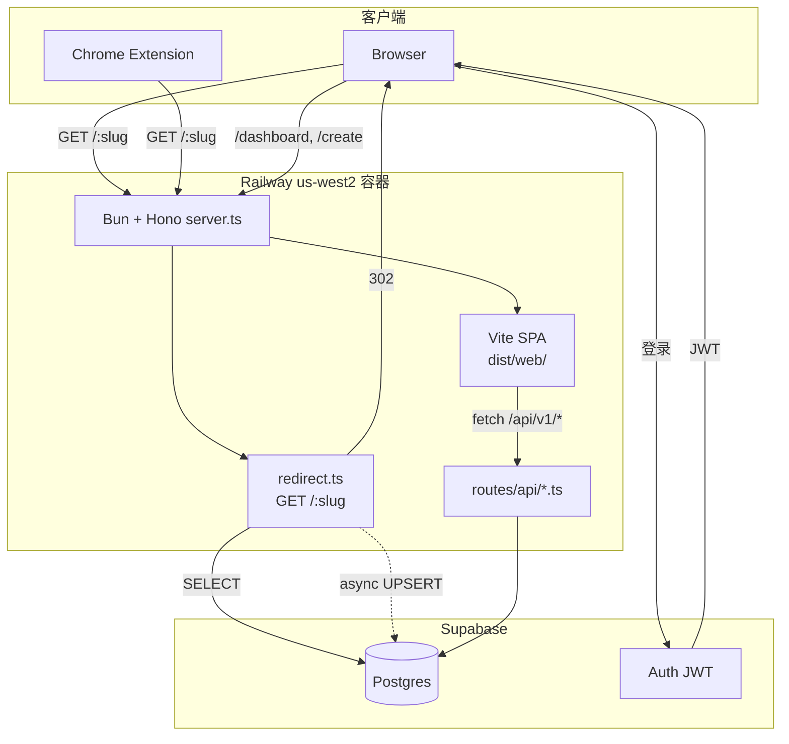

# CURRENT-ARCHITECT

> v2-hono 实现的当前架构. 修改代码后必须同步更新此文档. 详见 [`.claude/rules/current-architect.md`](../.claude/rules/current-architect.md).

## System Overview

### ASCII 简图

```
              ┌──────────────────────────────────────────────┐
              │   Railway 单容器 (us-west2, sjc-adjacent)    │
              │                                              │
   Browser ──▶│  Bun + Hono                                  │
   Extension  │   ├─ /:slug          → 302 + 异步 analytics  │
              │   ├─ /api/v1/health  → JSON                  │
              │   ├─ /api/v1/links   → CRUD                  │
              │   └─ /*              → 静态 SPA (dist/web)   │
              └──────────┬───────────────────────────────────┘
                         │ postgres-js + Drizzle
                         ▼
                 Supabase Postgres
                 (links / audit_logs / daily_visits / users)
                         ▲
                         │
                 Supabase Auth (JWT)
```

### Mermaid 详细图



## 模块说明

### 入口
- **`src/server.ts`** - Hono app 装配, 注册路由, 在生产托管 SPA. Bun 用 `default { port, fetch }` 自动监听.

### 路由
- **`src/routes/redirect.ts`** (`GET /:slug`)
  - 校验 slug 格式 + 保留路径; RESERVED 或不合法格式 → 404
  - 查询 `links` 表 (排除软删除)
  - 命中 → 302 立即返回, 用 `queueMicrotask` 异步累加 visits + UPSERT daily_visits
  - 未命中 (合法但未创建) → 302 到 `/edit/<slug>`, 让用户走 Landing 同款表单创建
- **`src/routes/api/health.ts`** (`GET /api/v1/health`) - 简单 JSON 健康检查
- **`src/routes/api/links.ts`** (`/api/v1/links`)
  - `GET /` - 列出最近 50 条公开链接 (stub, 待加分页 + 鉴权)
  - `POST /` - 创建链接 (stub, 待接 Turnstile + 指纹)
  - `GET /:slug` - 获取单链接

### 数据
- **`src/db/db.ts`** - postgres-js client + Drizzle 实例. `prepare: false` 兼容 Supabase pooler.
- **`src/db/schema.ts`** - Drizzle schema, 4 张表:
  - `users` (sync 自 Supabase auth.users)
  - `links` (slug 主键, soft delete, url_history JSONB)
  - `audit_logs` (CREATE/UPDATE/DELETE/CLAIM/VISIT/TRANSFER)
  - `daily_visits` (UNIQUE(slug, date), 用于 analytics)

### 前端 (SPA)
- **`src/web/`** - Vite + React 19 + react-router-dom v7. 详见 [`src/web/README.md`](../src/web/README.md).
  - `/` Landing (`src/web/pages/Landing/`) 由 `scripts/prerender.ts` 在构建期 SSG 预渲染到 `dist/web/index.html`.
  - `/edit/:slug` 复用 Landing 整页 (`pages/Edit.tsx` 渲染 `<Landing initialSlug={slug} />`), CreateForm 自动把光标放到 URL 字段.
  - `/dashboard` / `/create` / `/warn/:slug` 当前为 stub (`pages/ComingSoon.tsx`), 走客户端 lazy chunk.
  - 客户端 `src/web/main.tsx:14-32` 智能切换 `hydrateRoot` (Landing 命中预渲染) / `createRoot` (其他路径).
- 构建输出 `dist/web/`, 由 Hono `serveStatic` 在生产托管.

### 脚本 (前端构建)
- **`scripts/prerender.ts`** - SSG 入口, 由 `bun run build:web` 在 `vite build` 之后执行.
  - import `src/web/entry-ssr.tsx#renderApp("/")` 拿到 Landing HTML 字符串
  - 注入 `<title>` / `<meta>` (description / og:* / twitter:* / theme-color) + 防闪烁主题脚本
  - 写回 `dist/web/index.html`

### 脚本
- **`scripts/migrate-from-legacy.ts`** - MongoDB → Postgres 一次性迁移 (复用 v2-next)
- **`scripts/inspect-mongo.ts`** - 检查源数据形态

## 数据流

### 短链重定向 (hot path)
1. 用户访问 `https://go.example.com/abc`
2. Cloudflare CDN cache miss → 转 Railway
3. Hono `redirect.ts:slug` handler
4. Drizzle 查 `links WHERE slug=$1 AND deleted_at IS NULL`
5. 命中 → 返回 302 (响应已 flush 给客户端)
6. 异步: 事务内累加 `links.visits` + UPSERT `daily_visits`

### 创建短链
1. 用户在 Landing (或 `/edit/<slug>`, slug 自动预填) 填表, SPA POST `/api/v1/links` JSON `{slug, url}`
2. Hono `links.ts` zod 校验
3. INSERT, 唯一约束失败 (Drizzle 把 PG 的 23505 包成 `DrizzleQueryError`, 从 `err.cause.code` 解出) 返回 `SLUG_TAKEN` 409
4. 客户端拿到 409 后, 自动生成的 slug 重试一次; 用户自定义的 slug 则在表单内提示
5. 待补: 写 `audit_logs` CREATE 记录

## 环境变量

| 变量 | 必需 | 说明 |
|---|---|---|
| `DATABASE_URL` | ✅ | Supabase Postgres 连接串 (用 pooler `:6543`) |
| `PORT` | - | Railway 自动注入, 本地默认 3000 |
| `NODE_ENV` | - | `production` 时托管 SPA |
| `PUBLIC_BASE_URL` | 待用 | 生成完整短链时使用 |
| `TURNSTILE_SECRET_KEY` | 待用 | 创建链接的 bot 防护 |
| `TURNSTILE_SITE_KEY` | 待用 | 前端嵌入 |

## 启动流程

1. Bun 加载 `src/server.ts`
2. import `./routes/redirect.ts`, `./routes/api/*` 触发 db.ts 加载 → 检查 `DATABASE_URL`
3. Hono app 注册路由
4. `default { port, fetch }` 让 Bun 监听
5. Railway healthcheck 命中 `/api/v1/health` 后开始接流量

## 当前未实现 (TODO)

- Auth middleware (Supabase JWT 验证)
- Turnstile 校验
- 指纹 (`createdByFingerprint`) 计算
- `audit_logs` 写入
- `/warn/:slug` 警告页
- SPA 各页面具体实现 (Create / Dashboard / Analytics; 当前 Landing + Edit 实装, 其余 stub)
- 单元测试 + e2e 测试
- CI/CD (GitHub Actions → Railway)
