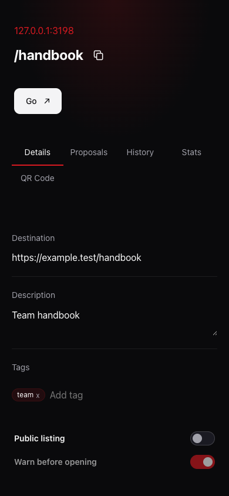
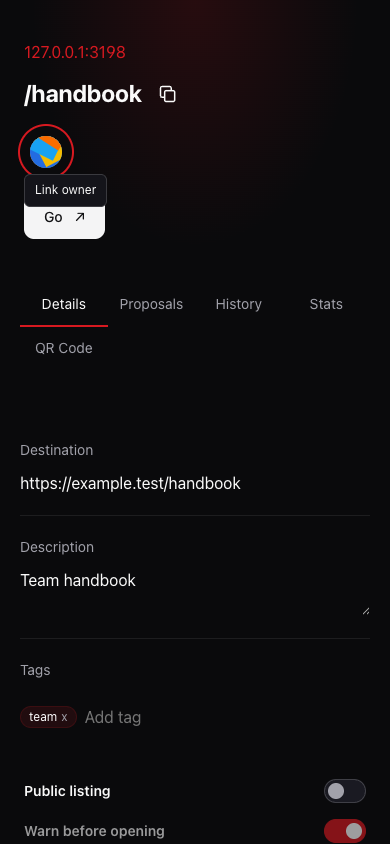

# 自动主人头像预览

真实 Chrome 的 390px 本地虚构 handbook 数据；after 使用 Jazzicon，键盘聚焦显示 Link owner。

| Before | After |
| --- | --- |
|  |  |

回归：`tests/proposals/owner-avatar.browser.spec.ts`，另有 1280/320px 布局检查。
