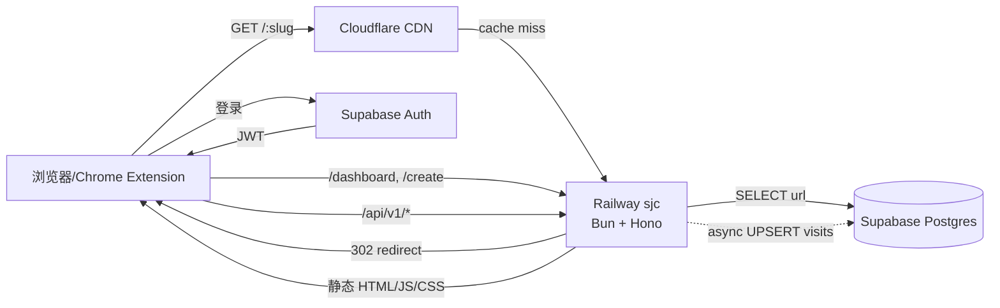

# v2-hono 重写计划 (Phase 1 已归档)

**Date**: 2026-05-07
**Duration**: 预估 3-4 周
**Priority**: P0
**Status**: ✅ Phase 1 (骨架) 完成 — Phase 2/3/4 内容已被 [`../2026-05-13-feature-parity-master-plan.md`](../2026-05-13-feature-parity-master-plan.md) 取代

> **归档说明 (2026-05-13)**: 阶段 1 骨架已完成; 阶段 2/3/4 的待办内容已迁移到 feature parity 总计划 (F1-F14), 不要再按本文档干活. 架构图见 `docs/CURRENT-ARCHITECT.md`. 本文保留仅作历史决策记录.

## Overview

v2 基于 Next.js 的实现 (`v2-next` 分支) 从未投产。鉴于实际使用场景:

- **流量**: ~50K visits/月, 几乎全部来自湾区, 单区域足矣
- **核心功能**: 短链重定向 + Analytics, 不需要 RSC / SSR / SEO
- **冷启动敏感**: 短链 redirect 必须毫秒级响应
- **预算**: 个人项目, 月费希望 ≤ $5

Next.js + Vercel 在该场景下属于过度配置 (overkill). 决定:

- **后端**: 改为 Bun + Hono 单容器, 直接连 Postgres
- **前端**: 改为 Vite + React 19 SPA, 由后端容器一并托管
- **部署**: 改为 Railway (us-west2, 永远在线, 无冷启动)
- **数据库**: 保留 Supabase Postgres + Drizzle (为未来 SQL analytics 做准备)
- **迁移路径**: 复用 v2-next 已写好的 MongoDB → Postgres 脚本

> 详见决策讨论: `docs/decisions/2026-05-07-platform-and-stack.md` (待补)

## 架构

### ASCII 简图

```
                  Railway (us-west2)
   ┌────────────────────────────────────────────┐
   │  Bun + Hono 单容器                          │
   │   ├─ GET /:slug      → 302 + 异步写 analytics │
   │   ├─ GET /api/v1/*   → JSON                  │
   │   └─ /*              → 静态托管 Vite SPA      │
   └────────────────┬───────────────────────────┘
                    │ postgres-js
                    ▼
            Supabase Postgres
            (links / audit_logs / daily_visits / users)
```

### Mermaid 详细图



## 兼容性范围

**仅 URL 兼容** (用户已确认):

- ✅ 旧 slug (`/{slug}` 重定向到原 URL) **必须保持工作**
- ❌ /api/v1/* 的 schema 可以演进 (Chrome Extension / 外部脚本如有需要会一起改)
- ❌ Dashboard / Create / Edit UI 可重新设计
- ❌ 用户 session 可重新登录

实现方式: 直接复用 v2-next 已写的 Drizzle schema + 迁移脚本, 把生产 MongoDB 数据迁到 Supabase Postgres 一次. slug 主键保持原样.

## Deliverables

### 阶段 1: 骨架与基础设施 (本周)
- [x] 删除 master 继承的 Nuxt 残留
- [x] 复用 v2-next 的 Drizzle schema + 迁移脚本
- [x] 初始化 package.json (bun + hono + drizzle + vite + react)
- [x] Hono server 骨架 (redirect + health + links stub)
- [x] Vite + React SPA 骨架
- [x] Dockerfile + railway.json
- [x] template.env
- [x] 计划文档

### 阶段 2: 核心 API + 认证 (第 1-2 周)
- [ ] `POST /api/v1/links` - 完整创建流程 (Turnstile + 指纹)
- [ ] `PATCH /api/v1/links/:slug` - 编辑 (含 url_history)
- [ ] `DELETE /api/v1/links/:slug` - 软删除
- [ ] `POST /api/v1/links/:slug/claim` - 匿名链接认领流程
- [ ] `POST /api/v1/links/:slug/transfer` - 所有权转移
- [ ] `GET /api/v1/audit/:slug` - 审计日志
- [ ] `GET /api/v1/stats/me` - 个人统计
- [ ] Supabase Auth 集成 (JWT 验证 middleware)
- [ ] /warn/:slug 警告页 (服务端渲染最小 HTML)

### 阶段 3: SPA Dashboard (第 2-3 周)
- [ ] 引入 react-router-dom 或 TanStack Router
- [ ] 登录页 (Supabase Auth UI)
- [ ] 创建页 (含 Turnstile widget)
- [ ] Dashboard (链接列表 + 基础 analytics)
- [ ] 编辑页
- [ ] Analytics 详情页 (折线图 - 复用 recharts)

### 阶段 4: 数据迁移与切流 (第 3-4 周)
- [ ] 在 Railway 部署 staging 环境
- [ ] 用 v2-next 迁移脚本将生产 MongoDB → Supabase 跑一次 dry-run
- [ ] 验证 slug 100% 保留, URL 一致
- [ ] 冻写窗口 + 正式迁移
- [ ] DNS 切流到 Railway
- [ ] 旧 Nuxt 服务保留 1 周作为回滚选项

## Implementation Steps

### Step 1: bun install + 本地启动
```sh
bun install
cp template.env .env
# 填入 DATABASE_URL (Supabase 项目)
bun run db:generate    # 生成 migrations (如果改了 schema)
bun run db:migrate     # apply migrations
bun run dev            # 启动 Hono
bun run dev:web        # 启动 Vite (另一个终端)
```

### Step 2: 实现 Auth middleware
- 校验 Supabase JWT, 注入 `c.set("userId", ...)`
- /api/v1/links POST 支持匿名和登录两种模式

### Step 3: Railway 首次部署
- Railway CLI: `railway init` → `railway up`
- 设置 env: DATABASE_URL, NODE_ENV, PUBLIC_BASE_URL, TURNSTILE_*
- 验证 healthcheck: `curl https://xxx.railway.app/api/v1/health`

### Step 4: 自定义域名
- Railway 接入 go.example.com
- Cloudflare CNAME 指向 Railway

## Timeline

| 周 | 里程碑 |
|---|---|
| W1 | 骨架完成, 本地能跑通 redirect |
| W2 | 完整 API + Auth |
| W3 | SPA 完成, Railway staging 上线 |
| W4 | 数据迁移 + 生产切流 |

## Success Criteria

- [ ] 所有旧 slug 在 v2-hono 上 302 跳转正确
- [ ] redirect p95 < 50ms (湾区)
- [ ] healthcheck 持续绿色 24 小时
- [ ] Dashboard 能展示 daily_visits 折线图
- [ ] Railway 月费 ≤ $5
- [ ] Lighthouse Performance ≥ 90 (Dashboard)

## Risks & 备选方案

| 风险 | 缓解 |
|---|---|
| Bun 在 Railway 容器里有边缘 case | 备选: 切回 Node 20 + 同样代码 (Hono 跨 runtime) |
| Vite SPA build 体积过大 | 备选: 路由级 code-split + lazy import |
| Supabase Auth JWT 验证逻辑不熟 | 备选: 先用简单的 cookie + own session 表 |
| 数据迁移 slug 冲突 | 迁移脚本需 dry-run 验证 + 冲突报告 |

## 历史决策记录

- 2026-05-07: 放弃 Next.js + Vercel, 改 Bun + Hono + Railway. 主因: 50K/月单区域场景下 Vercel Edge 无优势, Next.js 在 hot path 增加无价值开销
- 2026-05-07: 保留 Postgres + Drizzle (而非沿用 MongoDB). 主因: 长远 analytics 需要 SQL 能力, 且迁移脚本已写好
- 2026-05-07: v2-hono 从 master 而非 v2-next 起源. 主因: 心智上是平级 attempt, 不是 v2-next 的衍生
